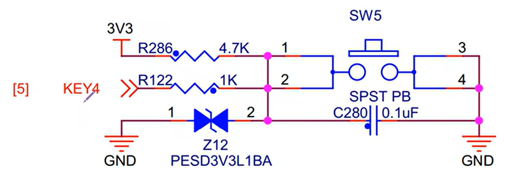
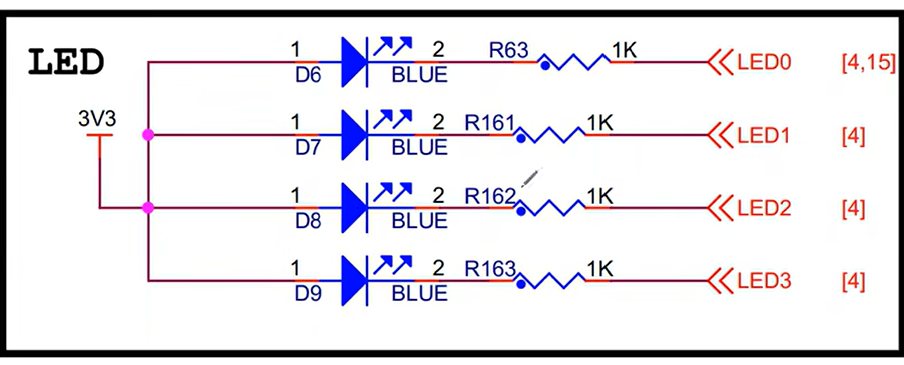
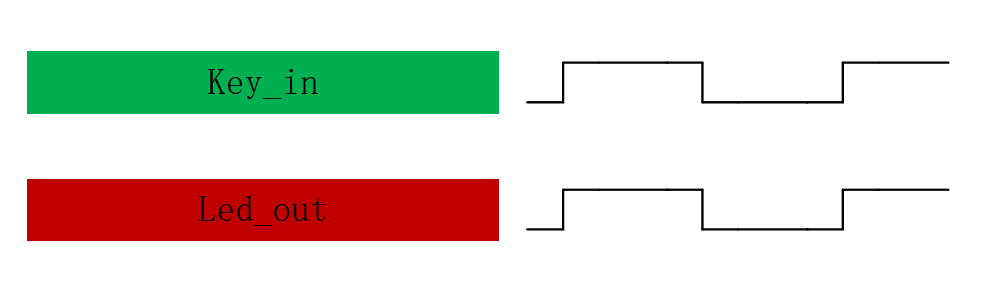
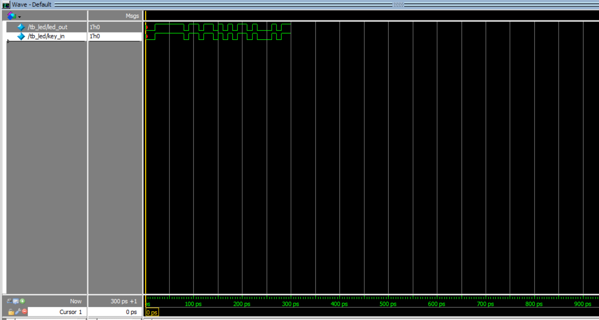

## 设计流程  
- 设计规划  
- 波形绘制 - 理清输入和输出的关系，便于代码编写  
- 代码编写,编译  
- 逻辑仿真  
- 波形对比：将仿真波形图与绘制出的进行对比  
- 绑定管脚  
- 分析综合，布局布线  
- 上板验证  
## 点亮LED灯  
1.项目文件体系：  
- doc：文档资料，波形图等  
- quartus工程文件  
- rtl：可生成硬件电路的代码  
- sim：仿真文件 
 
2.设计流程  
- 按键原理：如下图，R122所在位置是给FPGA新芯片的输出。按钮未按下时，电流从左上"3v3"的位置流向输出位置，输出信号时高电平(1);按钮按下时，电流从"3v3"的位置流向右下角"GND"的位置，R122位置输出低电平(0)

- LED灯原理：左边"3v3"处是高电平；右侧四个"<<"形状的由FPGA芯片控制输出。例如，若LED0处为低电平，则第一个LED灯两端产生电势差，LED灯亮；反之，若LED0处为高电平，则两端没有电位差，LED灯灭  
  
3.模块框图：清晰展示输入输出信号  
4.波形图绘制  
  
按钮按下时为低电平；LED亮起时也为低电平。所以输入和输出的波形图走势是相同的。 
```Verilog
/***************************/
/***       led.v         ***/
/***************************/
module led(
    input   wire        key_in,//输入，用于检测按钮的按下
    output  wire        led_out//输出，用于控制led灯的状态
);

assign led_out = key_in;//因为开关和LED灯的电平相同即可实现预期功能，所以直接将key_in 的电平赋值给led_out

endmodule
```
```Verilog
/***************************/
/***      tb_led.v       ***/
/***************************/

//仿真文件，由于是重点讲述设计流程，所以没有讲这个文件的作用
module tb_led();
wire led_out;
reg key_in;

initial key_in <= 1'b0;
always #10 key_in <= {$random} %2;//给key_in随机赋值0或1

led led_inst(
    .key_in (key_in),
    .led_out(led_out)
);

endmodule
```  
仿真结果  
  
可以看出，key_in和led_out的走势是相同的。  

# 第六讲 简单组合逻辑 多路选择器  
## 理论学习  
### 组合逻辑（与时序逻辑并列）  
- 特点：输出信号只是输入信号的函数，与其他时刻的输入状态无关。无存储电路，无反馈电路  
### 多路选择器  
有多个输入，从中选择符合条件的输出