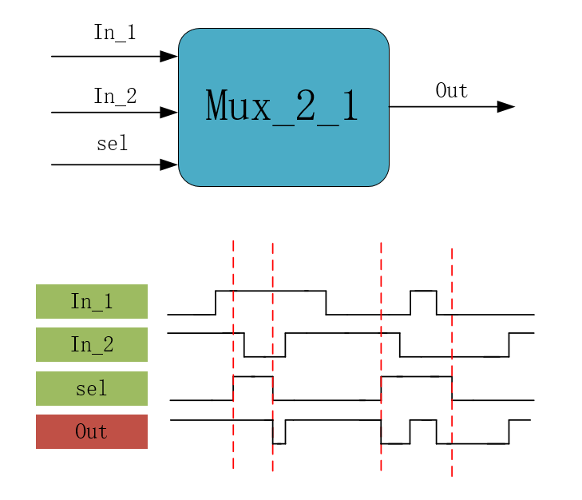
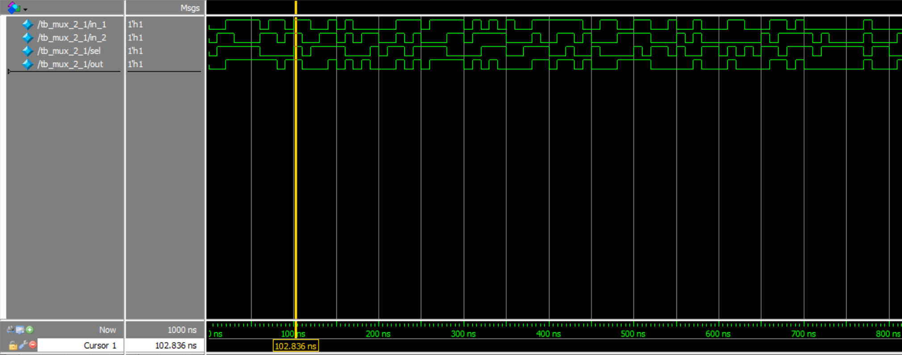
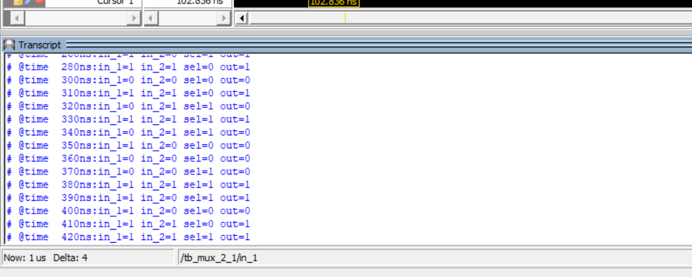

# 第六讲 简单组合逻辑 多路选择器  
## 理论学习  
### 组合逻辑（与时序逻辑并列）  
- 特点：输出信号只是输入信号的函数，与其他时刻的输入状态无关。无存储电路，无反馈电路  
### 多路选择器  
有多个输入，从中选择符合条件的输出  
- 输入输出以及波形图绘制
  
如上图，该电路有三个输入信号，一个输出信号。由sel信号决定输出信号和哪一个相同：若sel是高电平，则out与in_1相同；若为低电平则输出信号与in_2相同。  
- 代码编写  
一点语法知识
```Verilog
always@(*)//这里表示，只要括号中的东西发生改变，就执行一遍里面的语句。*表示所有元素。（怎么和css一样呢）此处就表示，任何元素发生变化时都执行一遍下面的语句
    if//Verilog的if...else...语句
        begin//begin和end在这里的作用类似于C里面的大括号{}
        ···
        end
    else if()
        begin
        ···
        end
    else
        begin
        ···
        end
```
项目文件 ：mux_2_1.v
```Verilog
module mux_2_1(//模块名称与文件名称尽量保持一致
    input   wire    [0:0]   in_1,//加逗号进行分隔
//输入信号  类型      位宽（因为是1位宽，可以省略）
    input   wire            in_2,
    input   wire            sel,
    
    output  reg             out//此处不需要加逗号
    //使用always赋值，必须为reg型
);


always@(*)
    if(sel == 1'b1)
        out = in_1;//只有一条语句，begin/end可省略
    else
        out = in_2;
//因为是组合逻辑，所以使用阻塞赋值(?)
endmodule
```
仿真文件 : tb_mux_2_1.v
```Verilog
`timescale 1ns/1ns
module tb_mux_2_1();//不需要输入输出信号
//对被仿真的模块进行输入输出的模拟

reg     in_1;
reg     in_2;
reg     sel ;

wire    out;//引出输出信号，便于观察

initial 
    begin
        in_1    <=  1'b0;//阻塞赋值
        in_2    <=  1'b0;
        sel     <=  1'b0;
    end
    
always #10 in_1 <= {$random} % 2;//延时10个时间单位，这里是10ns
always #10 in_2 <= {$random} % 2;
always #10 sel  <= {$random} % 2;

initial
    begin
        //这是设置时间格式的系统函数
        $timeformat(-9,0,"ns",6);//-9表示10e-9，即纳秒；0表示小数点后0位；ns要和前面对应；
        $monitor("@time %t:in_1=%b in_2=%b sel=%b out=%b",$time,in_1,in_2,sel,out);
    end


//实例化编写（调用被仿真的文件）
mux_2_1 mux_2_1_inst//模块名；实例化名称
(
    .in_1(in_1),//将被仿真文件中的in_1与仿真模块中的in_1相连接
    .in_2(in_2),
    .sel(sel),
    
    .out(out)
); 

endmodule
```  
仿真结果  
  

可以看出，当sel为低电平的时候，out与in_2相同；当sel为高电平的时候，out与in_1相同。  
## 阻塞赋值和非阻塞赋值  
### 阻塞赋值：(如b = a;)
- 赋值语句执行完后，块才结束  <a style = "color:red">(?)</a>  
- b的值在赋值语句执行完后立即改变  
- 可能会产生意想不到的后果 <a style = "color:red">(?)</a> 
### 非阻塞赋值如(b <=a )
- 块结束后才完成赋值操作  
- b的值不是立刻改变的  
- 比较常用，特别是写综合模块时 <a style = "color:red">(?)</a>  


# 第七讲 简单组合逻辑--译码器  
## 理论学习  
- 译码：译码是编码的逆过程。  
- 译码器可以将输入二进制代码的状态翻译成输出信号，以表示其原来的含义。  
- 译码器有多个输入，多个输出，可以分为变量译码和显示译码两类  
- 一般用于驱动LED或LCD  
## 实战演练：3-8译码器  