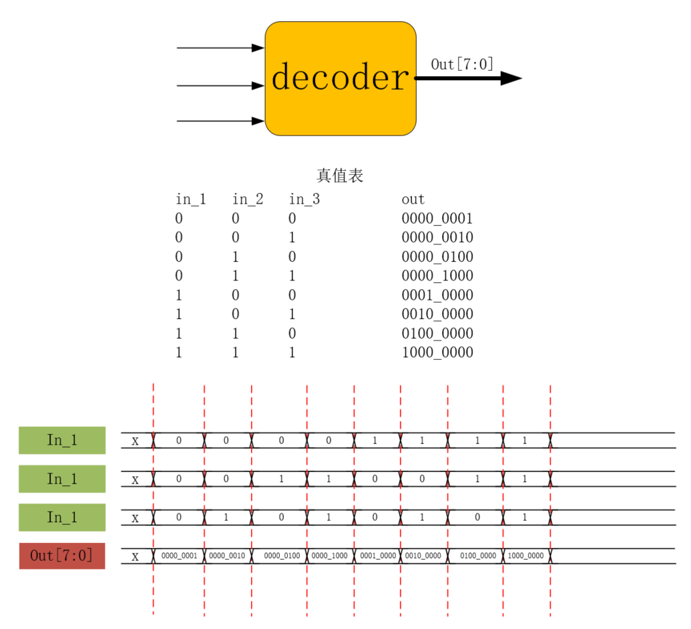
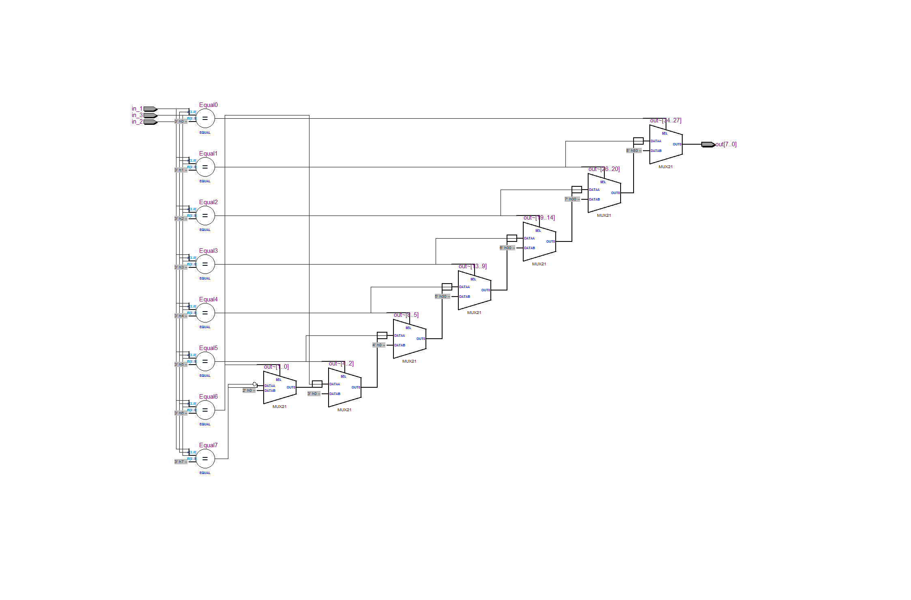
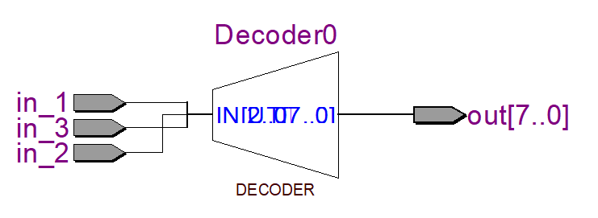

# 第七讲 简单组合逻辑--译码器  
## 理论学习  
- 译码：译码是编码的逆过程。  
- 译码器可以将输入二进制代码的状态翻译成输出信号，以表示其原来的含义。  
- 译码器有多个输入，多个输出，可以分为变量译码和显示译码两类  
- 一般用于驱动LED或LCD  
## 实战演练：3-8译码器  
- 目标：对于一个decoder，有三个输入，一个八位宽的输出。要使得对于输入所组成的每一种状态，输出都有一个位为1，与其对应。  
- 示意图和波形图  
  
- 代码：  

实现1：
```Verilog
module decoder(
    input   wire            in_1,
    input   wire            in_2,
    input   wire            in_3,
    output  reg     [7:0]   out
);
always@(*)
    //用if...else if...else实现，这里省略
endmodule
```

实现2：
```Verilog
module decoder(
    input   wire            in_1,
    input   wire            in_2,
    input   wire            in_3,
    output  reg     [7:0]   out
);
always@(*)
    case({in_1,in_2,in_3})//用case实现,类似C的switch
        3'b000	:out = 8'b0000_0001;
        3'b001	:out = 8'b0000_0010;
        3'b010	:out = 8'b0000_0100;
        3'b011	:out = 8'b0000_1000;
        3'b100	:out = 8'b0001_0000;
        3'b101	:out = 8'b0010_0000;
        3'b110	:out = 8'b0100_0000;
        3'b111	:out = 8'b1000_0000;
        default:out = 8'b0000_0000;
    endcase
endmodule
```
  
- 可以看出，使用if...else...语句得到了一个较为复杂的电路；使用case语句实现，整个项目被整合成了一个"decoder"。可能是因为Altera家的板子有现成的打包好的decoder，所以可以这么搞？  
- 输出结果（仅展示终端的输出结果）
```Transcript
# @time    0ns:in_1=0,in_2=0,in_3=0,out=00000001
# @time   10ns:in_1=0,in_2=1,in_3=1,out=00001000
# @time   20ns:in_1=1,in_2=1,in_3=1,out=10000000
# @time   30ns:in_1=1,in_2=0,in_3=1,out=00100000
# @time   60ns:in_1=0,in_2=1,in_3=0,out=00000100
# @time   70ns:in_1=1,in_2=1,in_3=0,out=01000000
# @time   80ns:in_1=1,in_2=0,in_3=0,out=00010000
# @time   90ns:in_1=0,in_2=1,in_3=0,out=00000100
```  
可以看出，译码器功能正常。  
# 第八讲 半加器  
## 半加器  
-加法器分为 __半加器__ 和全加器。  
- 半加可以接受两个一位的二进制数的输入，将它们加和，输出一个个位，输出一个进位。
- 示意图和波形图绘制
  
- 代码编写  
```Verilog
module half_adder(
    input   wire in_1,
    input   wire in_2,
    
    output  wire count,
    output  wire sum
);

assign {count,sum} = in_1+in_2;
//将in_1和in_2相加，结果放在由count和sum连接形成的变量中
endmodule
```  
- 仿真文件编写
```Verilog
`timescale 1ns/1ns
module tb_half_adder();

reg     in_1;
reg     in_2;

wire    sum;
wire    count;

initial
    begin
        in_1    <=  1'b0;
        in_2    <=  1'b0;
    end
    
always #10 in_1 <= {$random}%2;
always #10 in_2 <= {$random}%2;

initial
    begin
        $timeformat(-9,0,"ns",6);
        $monitor("@time %t:in_1=%b,in_2=%b,count=%b,sum=%b",$time,in_1,in_2,count,sum);
    end


half_adder half_adder_inst(
    .in_1   (in_1),
    .in_2   (in_2),

    .count  (count),
    .sum    (sum)
);

endmodule
```  

# 层次化设计思想 
## 理论学习
- 分类：自底向上和自顶向下  
- 自底向上：由基本单元构建高层单元，直至构成系统。  
- 自上而下：将系统不断向下划分，直到划分出来的单元可以用EDA元件库总的原件实现为止📍。  
- 一般两种方法是混合使用的。