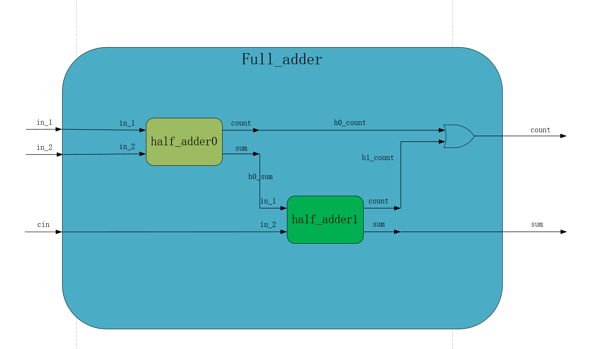

# 层次化设计思想 
## 理论学习
- 分类：自底向上和自顶向下  
- 自底向上：由基本单元构建高层单元，直至构成系统。  
- 自上而下：将系统不断向下划分，直到划分出来的单元可以用EDA元件库总的原件实现为止📍。  
- 一般两种方法是混合使用的。  
## 实践————全加器  
- 使用半加器作为部件制作全加器。  
- 全加器：根据我的理解，是输入三个一位的二进制数，计算这三个数的和。结果是一个二位的二进制数，其“十位”和“各位”分别存储在count和sum里面。  
- 设计图：  
  
根据设计图编写代码
```Verilog
module full_adder(
    input   wire    in_1,
    input   wire    in_2,
    inout   wire    cin,
    
    output  wire    sum,
    output  wire    count//使用assign语句，因此用wire
    
);

wire    h0_sum;
wire    h0_count;
wire    h1_count;

half_adder half_adder_inst0(//这里是相当于那一个半加器来使用，使其变成全加器的一部分
    .in_1   (in_1),//将全加器的in_1（括号中的）与半加器的in_1相连
    .in_2   (in_2),//同理
    
    .count  (h0_count),//将半加器的count输出连接全加器内部的h0_count
    .sum    (h0_sum)//同理
);

half_adder half_adder_inst1(
    .in_1   (cin),
    .in_2   (h0_sum),
    
    .count  (h1_count),
    .sum    (sum)
);

assign count = (h0_count|h1_count);
endmodule
```