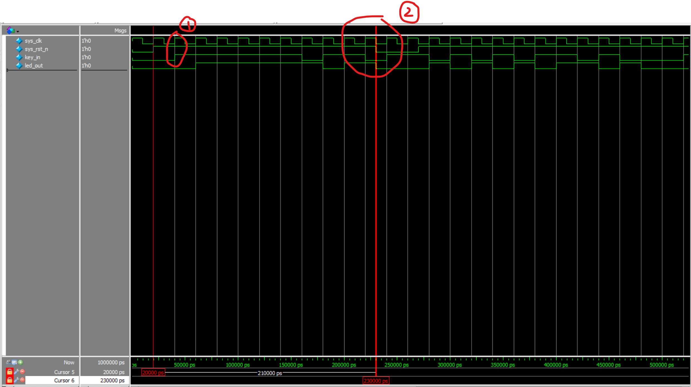

# 第十一讲 时序逻辑 寄存器 
## 理论学习（补充）
- 时钟信号由晶振传入，频率为50mHz
- 复位信号由复位按键输入  
- 在时序逻辑中，always的端口列表是时钟的上升沿或下降沿。（这样就可以达到类似锁帧的效果）
## 实际操作  
代码编写  
```Verilog
module flip_flop(
    input   wire    sys_clk     ,//系统时钟
    input   wire    sys_rst_n   ,//复位信号，后面的n表示，当该信号为0的时候复位（而不是1）
    input   wire    key_in      ,//检测按键按下

    output  reg     led_out     //LED灯亮
);

always@(posedge sys_clk or negedge sys_rst_n)//如果检测到系统时钟的上升沿或复位按键的下降沿
    begin
        if(sys_rst_n == 1'b0)//停止把按键的信号赋值给LED灯，转而将LED灯的信号赋值为0
            led_out <= 1'b0;
        else
            led_out <= key_in;//没有检测到复位按键的话就赋值
    end

endmodule
```
仿真代码
```Verilog
`timescale 1ns/1ns 
module tb_flip_flop();

reg sys_clk;
reg sys_rst_n;
reg key_in;

wire led_out;

initial
    begin
        sys_clk = 1'b1;
        sys_rst_n <= 1'b0;
        key_in <= 1'b0;
        #20//延时20ns
        sys_rst_n <= 1'b1;//复位信号是低电平有效，这里拉高使得系统能够正常工作
        #210
        sys_rst_n <= 1'b0;
        #40
        sys_rst_n <= 1'b1;
    end
    
always  #10 sys_clk = ~sys_clk;

always  #20 key_in <= {$random} % 2;


flip_flop flip_flop_inst(
    .sys_clk     (sys_clk),
    .sys_rst_n   (sys_rst_n),
    .key_in      (key_in),

    .led_out     (led_out)
);

endmodule
```
仿真结果  
  
__说明：__  
1. __红圈1__ 的位置sys_clk和key_in同时出现上升沿。此时key_in被判定为sys_clk上升之前的位置（即低电平）。所以在后一段时间内，虽然输入为高电平，但是led_out的电平并未改变。只有到了下一次，sys_clk再次出现上升沿时，再次进行判定，key_in的高电平才有效。这时led_out才进行改变。因此led_out的升高滞后key_in的升高一个周期。  
2. __红圈2__ 的位置，复位信号电平降低后led_out的电平也立刻降低。这是因为alway那里同时还检测了sys_rst_n的下降沿，因此sys_rst_n一旦下降，led_out也立刻下降。  


# 第十二讲 阻塞赋值与非阻塞赋值  
## 理论学习  
### 阻塞赋值
- 阻塞赋值用'='表示。在执行阻塞赋值语句的时候，不允许任何Verilog语句的干扰。在这一条语句执行完后，才会执行下一条。
- 阻塞赋值对应的电路结构往往与触发沿没有关系，只与输入电平的变化有关。
- 在 __串行块__ __(begin-end)__ 中，各条阻塞赋值语句将以它们的排列顺序依次执行。
```Verilog
//以这一段代码为例
a=1,b=2,c=3;
begin
    a = b+1;//此时a的值变为3
    b = a+2;//此时b=3+2=5
    c = a-1;//c=3-1=2
end
```
### 非阻塞赋值  
- 使用小于等于号进行赋值，一般只有在触发沿的时刻才能进行赋值  
- 在赋值开始的时候，计算后面的数值；在计算完之后才会更新左边的语句。在执行期间，还允许其他的Verilog语句执行。  
- 非阻塞操作只允许对寄存器变量进行操作，因此只能用于initial和always块中，不允许用于连续赋值"assign"
```Verilog
a=1,b=2,c=3
begin
    a <= b+1;//右边的值是3
    b <= a+2;//右边的值是3
    c <= a-1;//右边的值是0
    //在计算完之后，再统一赋值
end
```  
## 实战演练  
