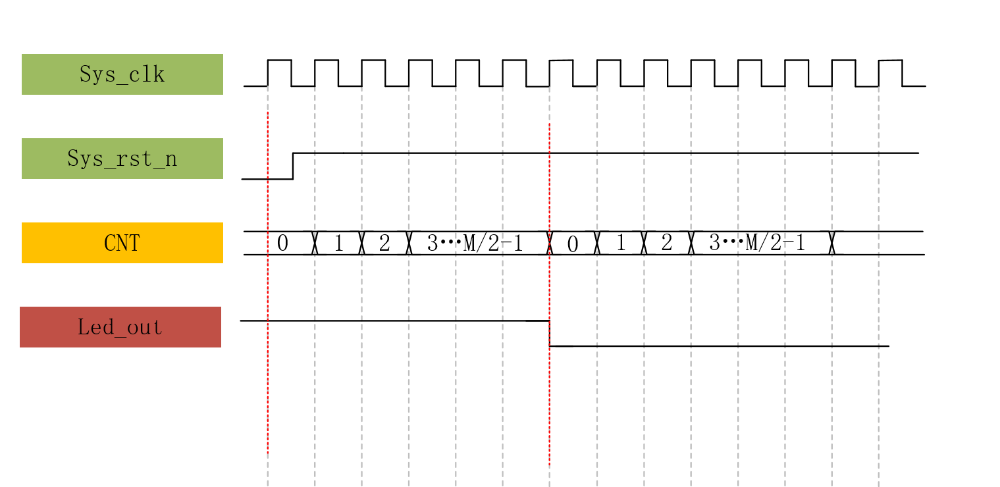

# 第十三讲 计数器  
## 实践操作  
- 波形图  
  
说明：M是1s内LED灯“亮-暗”周期的个数，可以通过1/时钟主频得到。在这里，时钟频率是50MHz，可以计算得到$M=5\times10^7$,因此这时就可以计算$\frac{M}{2}-1=24\_999\_999$。将其转换为二进制，可以得到它的位宽是25.  

- 编写代码  
```Verilog
//主模块
module counter
#(
    parameter   CNT_MAX = 25'd24_999_999//定义了一个常量
)
(
    input   wire    sys_clk,
    input   wire    sys_rst_n,

    output  reg     led_out
);


reg     [24:0]      cnt;//计数，24位宽


always@(posedge sys_clk or negedge sys_rst_n)
    if(sys_rst_n == 1'b0)//一旦复位信号激活
        cnt <= 25'd0;//立刻将计数器归零
    else    if(cnt == CNT_MAX)//如果没有激活，
        cnt <= 25'd0;//就在到达最大时归零
    else 
        cnt <= cnt + 25'd1;//或者是在一般情况下+1
        
        
        
always@(posedge sys_clk or negedge sys_rst_n)
        if(sys_rst_n ==  1'b0)
            led_out <= 1'b0;//如果复位信号激活，就将led设为0
        else    if(cnt == CNT_MAX)
            led_out <= ~led_out;//如果到达最大值就反转
        else
            led_out <= led_out;//如果是一般情况就保持值不变


endmodule
```

```Verilog
//仿真代码
`timescale 1ns/1ns 
module  tb_counter();

reg     sys_clk;
reg     sys_rst_n;

wire    led_out;

initial
    begin
        sys_clk =  1'b1;
        sys_rst_n <= 1'b0;//先将复位信号激活一段时间
        #20//等待20纳秒
        sys_rst_n <= 1'b1;//deactive复位信号，仿真开始
    end
    
always #10 sys_clk = ~sys_clk;//每隔10ns反转一次sys_clk,模拟时钟信号


counter
#(
    .CNT_MAX(25'd24)//在仿真时，按照24计算，而不是24_999_999
)counter_inst
(
    .sys_clk    (sys_clk),
    .sys_rst_n  (sys_rst_n),

    .led_out    (led_out)
);

endmodule
```

- 仿真结果：每隔24ns，led灯的状态反转一次。（而不是实际上的0.5s，原因见该md文件的第70行）（忘了截图了）  
- 悲伤的故事：昨天写了一遍这个东西，一上来就上板验证，结果led一直亮着。又仿真验证，结果不知道哪里出了问题，led_out一直保持高电平。今天重写的时候把昨天的删了，现在找不到了T_T