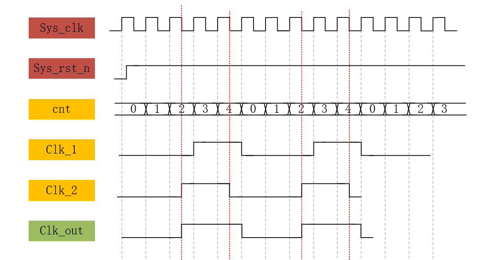

# 第十四讲 偶分频器  
- 回顾：上次用类似计数器的方法实现了一个六分频器，实现了将系统时钟的频率降低了六倍。但是这样的实现是不够好的。因为新的clk_out并未连接到全局时钟网络。在系统时钟频率足够高的时候，就会产生各种问题。解决方法是，使用一个脉冲标志信号。  
### 解决方案  
```Verilog
reg     [2:0]   cnt;//cnt计数的最大值变为5，位宽改为3
reg     clk_flag;//脉冲标志信号

always@(posedge sys_clk or negedge sys_rst_n)
    if(sys_rst_n == 1'b0)
        cnt <= 3'd0;
    else if (cnt == 3'd5)//cnt计数信号的最大值改为5
        cnt <= 3'd0;
    else
        cnt <= cnt + 3'd1;

always@(posedge sys_clk or negedge sys_rst_n)
    if(sys_ret_n == 1'b0)
        clk_flag <= 1'b0;
    else if(cnt == 3'd5)
        clk_flag <= 1'b1;
    else
        clk_flag <= 1'B0;
```

这样，在需要用到低频时钟的时候，只需要：  
```Verilog
always@(posedge sys_clk or negedge sys_rst_n)
    if(sys_ret_n == 1'b0)
        ......
    else if(clk_flag == 1'b1)
    //如果检测到系统时钟的上升沿且clk_flag也被激活的话，就执行操作
        ......
```
相比原来的方案，新的方案在always@语句的检测条件中使用系统时钟为检测条件（而不是新生成的信号）。  
# 第十五讲 奇分频  
- 理论：和偶分频器相同  
## 实践操作  
- 绘制波形图 
  
说明：cnt是计数器变量，该变量在记到4后清零，总共5个数。  
clk_1和clk_2分别是两个中间信号。它们在一个周期内都是3-2的变化。  
将clk_1和clk_2进行或运算，即可得到高低电平占比均为50%的五分时钟。 
 
- 代码编写
```Verilog
module divider_five
(
    input   wire    sys_clk,
    input   wire    sys_rst_n,
    
    output  wire    clk_out
);

reg     [2:0]   cnt;
reg             clk_1;
reg             clk_2;

//cnt
always@(posedge sys_clk or negedge sys_rst_n)
    if(sys_rst_n == 1'b0)
        cnt <= 3'd0;
    else if(cnt == 3'd4)
        cnt <= 3'd0;
    else
        cnt <= cnt+3'd1;
        
        
//clk_1
always@(posedge sys_clk or negedge sys_rst_n)
    if(sys_rst_n == 1'b0)
        clk_1 <= 1'b0;
    else if (cnt == 3'd2)
        clk_1 <= 1'b1;
    else if (cnt == 3'd4)
        clk_1 <= 1'b0;
    else
        clk_1 <= clk_1;


//clk_2
always@(negedge sys_clk or negedge sys_rst_n)
    if(sys_rst_n == 1'b0)
        clk_2 <= 1'b0;
    else if (cnt == 3'd2)
        clk_2 <= 1'b1;
    else if (cnt == 3'd4)
        clk_2 <= 1'b0;
    else
        clk_2 <= clk_2;


assign clk_out = (clk_1 | clk_2);

endmodule
```
仿真代码略（和六分频器是完全一样的）  
- 仿真结果


- __😡😨__
```txt
    刚刚仿真的时候，所有的信号都要么是不确定X，要么是高阻态Z。重新在modelsim编译了好几遍都没用。我又对着视频检查了好几遍代码都没有出问题。结果把项目全部删掉，重新建立一遍项目就好了😡信号正常输出。
    重新仿真一次，结果信号一直是平的，没有任何变化！😨😨😨吓得我又重新编译了一次还是这样。再仔细检查才发现是仿真实践设置的太短了。
```

# 第十六讲 按键消抖  
## 理论学习 
- 按键抖动主要指的是机械开关。这种开关在闭合或断开时，不会立马进行闭合或断开，而是会出现一连串的抖动。  
- 按键消抖分为软件的方法和硬件的方法。