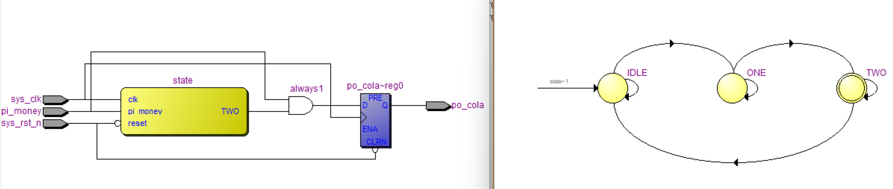

# 状态机（非常重要）  
## 理论学习  
- 状态机的简写是 __FSM__ __(Finite State Machine)__，也称为 __同步有限状态机__。它状态的跳转是由时钟决定的，分为Moore型状态机和Mealy型状态机。可以处理具有前后顺序的事件。  
- 从执行一个时间到执行另一个时间叫做状态的跳转。
## 实战演练
- 问题情景：假设有一个可乐售卖机器。可乐售价3元，每次只能投入一枚一元硬币，投入三枚，就会吐出可乐
- 状态转移图的要素：输入，输出，状态。对于可乐机来说，输入是投入硬币，输出有"出可乐/不出可乐"，状态有"投入0/1/2/3元"
- 状态机绘制

独热码相比二进制，可以节省组合逻辑资源（只需要比较一位），但是会增加寄存器资源的消耗。而寄存器资源是相对较多的，因此选择使用独热码。
- 代码编写
```Verilog
module simple_fsm
(
    input   wire        sys_clk,
    input   wire        sys_rst_n,
    input   wire        pi_money,//投入钱的信号
    
    output  reg         po_cola//出可乐的信号

);

//状态机状态参数

parameter   IDLE    =   3'b001;
parameter   ONE     =   3'b010;
parameter   TWO     =   3'b100;
//采用了独热码，每一个状态只有一位为1

reg     [2:0]   state;


//在各个状态之间的跳转
always@(posedge sys_clk or negedge sys_rst_n)
    if(sys_rst_n == 1'b0)
        state   <=  IDLE;
    else    case(state)
        IDLE:   if(pi_money == 1'b1)
                    state   <=  ONE;
                else
                    state   <=  IDLE;
        ONE:    if(pi_money == 1'b1)
                    state   <=  TWO;
                else
                    state   <=  ONE;
        TWO:    if(pi_money == 1'b1)
                    state   <=  IDLE;
                else
                    state   <=  TWO;
        default:state   <=  IDLE;
	endcase
        
//如果状态为2个硬币且投入钱的信号被激活的话，就激活“出可乐”的信号
always@(posedge sys_clk or negedge sys_rst_n)
    if(sys_rst_n == 1'b0)        
        po_cola <= 1'b0;
    else    if((state == TWO)&&(pi_money))
        po_cola <= 1'b1;
    else
        po_cola <= 1'b0;
endmodule
```
- 可以看到，在下面的RTL视图中，该设计被综合成了一个状态机。同时也可以查看状态机视图。  

- 仿真结果略。需要注意的一点是，由于采用了时序逻辑，所以输出结果会延迟输入一个周期出现。

## 实战演练2：更复杂的可乐机
- 实现目标：可乐定价为2.5元；可以投入1元或0.5元的硬币；可以找零。
### 状态机绘制  

### Verilog代码
```Verilog
module complex_fsm
(
    input   wire    sys_clk		,
    input   wire    sys_rst_n		,
    input   wire    pi_money_half,
    input   wire    pi_money_one	,

    output  reg     po_cola		,
    output  reg     po_money
);

reg     [4:0]   state;
//第一遍的时候这里出错了没检查出来。注意，由于此处选用的表示状态的方式，位宽必须为5，而不是认为2^3=8>5,从而选用3位！！


//注意这里，类似于C中的define，但是写法和define是不同的！define没有等号，但是这里有等号！！
parameter   IDLE     =    5'b00001;
parameter   HALF     =    5'b00010;
parameter   ONE      =    5'b00100;
parameter   ONE_HALF =    5'b01000;
parameter   TWO      =    5'b10000;
                                
//简单起见，假设1元和5毛不会同时投入。若同时投入则优先计算1元的。

//以下是状态机的代码
always@(posedge sys_clk or negedge sys_rst_n)
    if(sys_rst_n == 1'b0)
        state <= IDLE;
    else    case(state)
        IDLE:       if(pi_money_one == 1'b1)
                        state <= ONE;
                    else if(pi_money_half == 1'b1)
                        state <= HALF;
                    else
                    state <= IDLE;
        HALF:       if(pi_money_one == 1'b1)
                        state <= ONE_HALF;
                    else if(pi_money_half == 1'b1)
                        state <= ONE;
                    else
                    state <= HALF;
        ONE:        if(pi_money_one == 1'b1)
                        state <= TWO;
                    else if(pi_money_half == 1'b1)
                        state <= ONE_HALF;
                    else
                    state <= ONE;
        ONE_HALF:   if(pi_money_one == 1'b1)
                        state <= IDLE;
                    else if(pi_money_half == 1'b1)
                        state <= TWO;
                    else
                    state <= ONE_HALF;
        TWO:        if(pi_money_one == 1'b1)
                        state <= IDLE;
                    else if(pi_money_half == 1'b1)
                        state <= IDLE;
                    else
                    state <= TWO;
        default:    state <= IDLE;
    endcase

//这部分负责处理可乐信号    
always@(posedge sys_clk or negedge sys_rst_n)
    if(sys_rst_n == 1'b0)
        po_cola <= 1'b0;
    else if(     ((state == ONE_HALF)&&(pi_money_one == 1'b1))      ||        ((state == TWO)&&(pi_money_one == 1'b1))         ||      ((state == TWO)&&(pi_money_half == 1'b1))           )//输出可乐信号的三种情况：1.机器里面有2.5元，投进去1元；另外两种略
        po_cola <= 1'b1;
    else
        po_cola <= 1'b0;


//这部分负责处理找零信号    
always@(posedge sys_clk or negedge sys_rst_n)
    if(sys_rst_n == 1'b0)
        po_money <= 1'b0;
    else if((state == TWO)&&(pi_money_one == 1'b1))//只有在机器里面有2，且投入1元的时候才会找零
        po_money <= 1'b1;
    else
        po_money <= 1'b0;
endmodule
```

### 仿真代码：略（和之前的都差不多）
### 在这里贴一个视频,作为长期的目标
<iframe src="https://www.bilibili.com/video/BV1yM41127MK/" width="600px" height="400px"></iframe> 