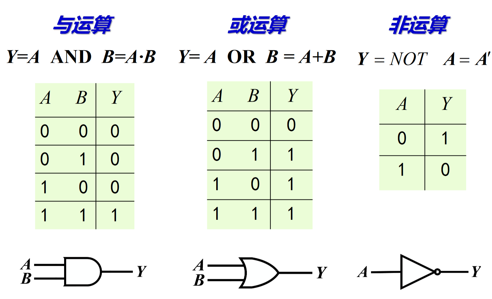
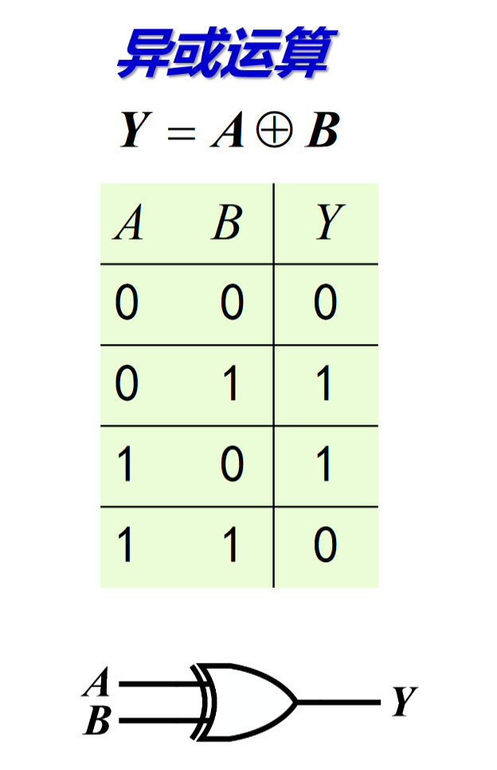

- 二进制和八进制之间的转换：每三位二进制数字转换为一个八进制数字。  
- 二进制数字/十六进制数字小数点后变换十进制：按照“权”处理，如$2^{-1}$,或$2^{-2}$等  
- 二进制的正负：用一位二进制表示  
### 二进制数的补码  
在定点运算中，最高位为符号位。  
如：  
-5 0_0101  
+5 1_0101  

这样就会出现问题：1.+5和-5的和不是0&emsp;
2.出现了+0和-0，造成了浪费  

问题的本质是，符号位是码制，数值部分是数制。将两部分混合后还需要进行数学运算。  
  
为了解决上述问题，采用了补码的方式。  

补码的实质是，二进制最高的一位权重为$-2^{N-1}$.  

正数的补码就是它本身。  
负数的补码：最高位是1，剩下的位就是和最高位能凑整的数字。具体方法是，数值位逐个取反，然后+1.   

二进制补码的编码原则  

- 等长编码：每一个事物分得码的长度是一致的  
- 例如，十进制数字用二进制表达至少需要四位二进制数。又称为BCD码(binary code decimal).  
- 又如。ASCII码使用了7位二进制。

几种常见的十进制代码：其它的代码比起8421码的优点是，假如两个数相加会进位，则它们的代码相加也会进位。（而不是像8421码一样，两个数字相加以后，它们的和仍有可能落在编码可以表示的区域内）。但是还会有别的缺点。
 
- 格雷码：每一位状态变化都按一定的顺序循环。它使得相邻数字之间只有一位发生变化。
- 变长编码：频繁出现的用短的编码，较少出现的用相对较长的编码。最早提出变长编码的就是哈夫曼编码

# 第二讲 逻辑代数基本公式和基本定理 
## 目标  
- 基本逻辑运算 
- 基本公式和表示方法 
- 化简
## 
- 布尔代数：所有的值都是二进制值
- 目前的数字电路使用半导体器件，但是技术发展以后可能会有其他的实现。不过逻辑代数本身是不会再改变的了。  
## 逻辑运算的方式  
- 与或非 
- 要在逻辑世界中描述现实事物，首先要进行编码。编码不同，逻辑不一定一样。  
### 与 $Y=A·B=AB$
### 或 $Y=A+B$
### 非 $Y=A'$

说明：只要遇到小圈(非上面那个)，就进行取反
### 异或 $A \oplus B$
相同时取0，不同时取1  
$A\oplus B=A'B+AB'$

### 同或 $A\odot B=(A\oplus B)'$ 

## 基本公式  
$$A(B+C)=AB+AC$$
$$(AB)'=A'+B'$$
$$A+BC=(A+B)(A+C)$$
$$(A+B)'=A'B'$$
证明方法：穷举；推演